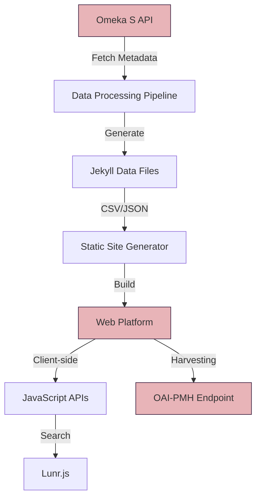
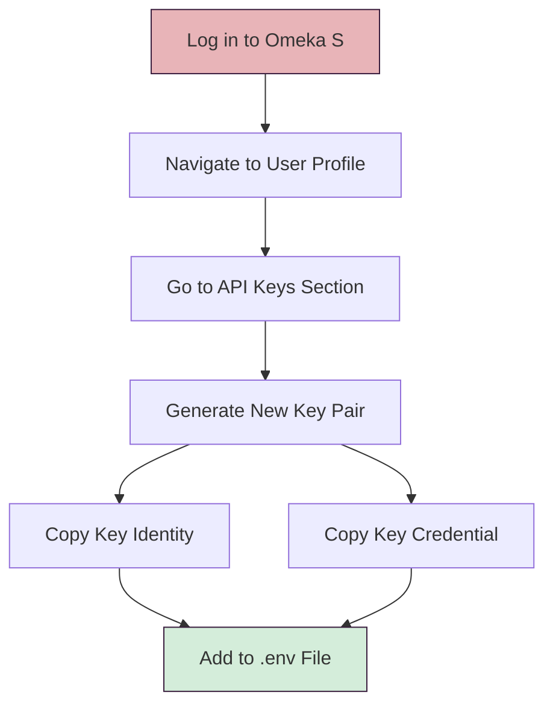
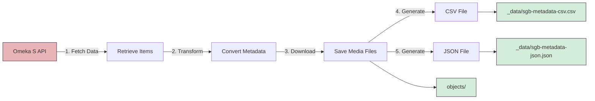

# API Documentation

This document describes the APIs and data interfaces used in the forschung.stadtgeschichtebasel.ch project.

## Table of Contents

- [Overview](#overview)
- [Omeka S API](#omeka-s-api)
- [Data Processing Pipeline](#data-processing-pipeline)
- [Internal APIs](#internal-apis)
- [JSON Data Feeds](#json-data-feeds)
- [Schema.org Integration](#schemaorg-integration)
- [OAI-PMH Endpoint](#oai-pmh-endpoint)

## Overview

The Stadt.Geschichte.Basel research data platform integrates several APIs and data sources:



**Key Components**:

- **Omeka S API**: Primary source for collection metadata
- **Jekyll Data Files**: Static JSON/CSV files generated from Omeka
- **JavaScript APIs**: Client-side data access through Lunr.js and custom scripts
- **OAI-PMH**: Metadata harvesting endpoint for external systems

## Omeka S API

The platform fetches collection data from the [University of Bern's Omeka S instance](https://omeka.unibe.ch/s/stadtgeschichtebasel/page/sgb).

### Authentication

API access requires authentication via key credentials:

```bash
# Environment variables (.env file)
OMEKA_API_URL=https://omeka.unibe.ch/api
KEY_IDENTITY=your_key_identity
KEY_CREDENTIAL=your_key_credential
ITEM_SET_ID=10780
```

### Getting API Keys



**Steps**:

1. Log in to [Omeka S](https://omeka.unibe.ch)
2. Navigate to your user profile
3. Go to "API Keys" section
4. Generate a new key pair
5. Copy `Key Identity` and `Key Credential`
6. Add to your `.env` file

### API Endpoints Used

#### List Items in Item Set

```http
GET /api/items?item_set_id={ITEM_SET_ID}&per_page=100
```

**Parameters**:

- `item_set_id`: The ID of the collection (default: 10780)
- `per_page`: Number of items per page (max: 100)
- `page`: Page number for pagination

**Headers**:

```http
key_identity: YOUR_KEY_IDENTITY
key_credential: YOUR_KEY_CREDENTIAL
```

**Response**: Array of item objects with metadata

#### Get Single Item

```http
GET /api/items/{item_id}
```

**Response**: Single item object with full metadata

#### Get Media for Item

```http
GET /api/media?item_id={item_id}
```

**Response**: Array of media objects associated with the item

### Example Request

```bash
curl -X GET "https://omeka.unibe.ch/api/items?item_set_id=10780&per_page=10" \
  -H "key_identity: YOUR_KEY_IDENTITY" \
  -H "key_credential: YOUR_KEY_CREDENTIAL"
```

### Example Response

```json
[
  {
    "@context": "http://omeka.org/s/jsonld",
    "@type": ["o:Item"],
    "o:id": 12345,
    "dcterms:title": [
      {
        "type": "literal",
        "property_label": "Title",
        "@value": "Example Item"
      }
    ],
    "dcterms:description": [
      {
        "type": "literal",
        "@value": "Description of the item"
      }
    ],
    "o:media": [
      {
        "@id": "https://omeka.unibe.ch/api/media/67890"
      }
    ]
  }
]
```

## Data Processing Pipeline

The data processing script (`process_data.py`) transforms Omeka S data into Jekyll-compatible formats.

### Running the Pipeline

```bash
# Process all data from Omeka S
npm run populate

# Or run directly
uv run .github/workflows/process_data.py
```

### Processing Steps

The data processing pipeline transforms Omeka S data into Jekyll-compatible formats through these steps:



**Steps**:

1. **Fetch Data**: Retrieve items from Omeka S API
2. **Transform Metadata**: Convert Omeka fields to CollectionBuilder schema
3. **Download Media**: Fetch and save media files to `objects/`
4. **Generate CSV**: Create `_data/sgb-metadata-csv.csv`
5. **Generate JSON**: Create `_data/sgb-metadata-json.json`

### Output Files

#### CSV Metadata File

Location: `_data/sgb-metadata-csv.csv`

Contains all item metadata in CSV format for Jekyll processing.

**Key Columns**:

- `objectid`: Unique identifier (e.g., `abb01313`)
- `title`: Item title
- `subject`: Semicolon-separated subjects
- `description`: Item description
- `creator`: Creator/author
- `date`: Date of creation
- `temporal`: Historical period
- `type`: Media type
- `format`: File format
- `filename`: Media filename
- `latitude`: Geographic coordinate
- `longitude`: Geographic coordinate

#### JSON Metadata File

Location: `_data/sgb-metadata-json.json`

Contains metadata in JSON format for JavaScript processing.

**Structure**:

```json
[
  {
    "objectid": "abb01313",
    "title": "Example Item",
    "subject": ["Subject1", "Subject2"],
    "description": "Item description",
    "date": "1950-01-15",
    "temporal": "20. Jahrhundert",
    "filename": "abb01313.jpg",
    "type": "Image",
    "format": "image/jpeg"
  }
]
```

## Internal APIs

The platform provides several JavaScript-based APIs for client-side functionality.

### Lunr.js Search Index

Location: `assets/data/lunr-index.json` (generated during build)

**Purpose**: Full-text search functionality

**Usage**:

```javascript
// Initialize Lunr index
const idx = lunr.Index.load(indexData);

// Search
const results = idx.search("query");
```

### Data JSON

Location: `assets/data/metadata.json`

**Purpose**: Client-side access to all metadata

**Usage**:

```javascript
fetch("/assets/data/metadata.json")
  .then((response) => response.json())
  .then((data) => {
    // Process metadata
    data.forEach((item) => {
      console.log(item.title);
    });
  });
```

### Timeline Data

Location: `assets/data/timeline-data.json` (generated for timeline page)

**Purpose**: Date-sorted items for timeline visualization

**Structure**:

```json
[
  {
    "objectid": "abb01313",
    "title": "Example",
    "date": "1950-01-15",
    "year": 1950,
    "temporal": "20. Jahrhundert"
  }
]
```

## JSON Data Feeds

The platform exposes several JSON endpoints for integration with external systems.

### Collection Metadata Feed

```
https://forschung.stadtgeschichtebasel.ch/assets/data/metadata.json
```

**Format**: Array of objects with full metadata

**Use Cases**:

- External aggregators
- Custom visualizations
- Data analysis tools

### Subjects/Keywords Feed

```
https://forschung.stadtgeschichtebasel.ch/assets/data/subjects.json
```

**Format**: Object mapping subjects to item counts

**Example**:

```json
{
  "Basel": 150,
  "Architecture": 89,
  "19th Century": 234
}
```

### Geospatial Data

Items with geographic coordinates can be accessed:

```
https://forschung.stadtgeschichtebasel.ch/assets/data/geodata.json
```

**Format**: GeoJSON FeatureCollection

**Example**:

```json
{
  "type": "FeatureCollection",
  "features": [
    {
      "type": "Feature",
      "properties": {
        "objectid": "abb01313",
        "title": "Example Location"
      },
      "geometry": {
        "type": "Point",
        "coordinates": [7.5886, 47.5596]
      }
    }
  ]
}
```

## Schema.org Integration

All item pages include structured data using Schema.org vocabulary.

### Metadata Format

The platform embeds JSON-LD in item pages:

```html
<script type="application/ld+json">
  {
    "@context": "http://schema.org",
    "@type": "CreativeWork",
    "name": "Item Title",
    "description": "Item description",
    "creator": {
      "@type": "Organization",
      "name": "Creator Name"
    },
    "dateCreated": "1950-01-15",
    "image": "https://forschung.stadtgeschichtebasel.ch/objects/abb01313.jpg",
    "license": "https://creativecommons.org/licenses/by/4.0/"
  }
</script>
```

### Supported Types

- `CreativeWork`: General items
- `ImageObject`: Images
- `MediaObject`: Audio/video
- `Dataset`: Data files

### Testing Schema.org Markup

Use [Google's Rich Results Test](https://search.google.com/test/rich-results) to validate:

```
https://forschung.stadtgeschichtebasel.ch/items/abb01313.html
```

## OAI-PMH Endpoint

The platform can optionally expose an OAI-PMH endpoint for metadata harvesting.

### Endpoint URL

```
https://forschung.stadtgeschichtebasel.ch/oai-pmh/
```

### Supported Verbs

#### Identify

```http
GET /oai-pmh/?verb=Identify
```

Returns information about the repository.

#### ListMetadataFormats

```http
GET /oai-pmh/?verb=ListMetadataFormats
```

Returns available metadata formats (Dublin Core, JSON-LD).

#### ListRecords

```http
GET /oai-pmh/?verb=ListRecords&metadataPrefix=oai_dc
```

Returns all records in the specified format.

#### GetRecord

```http
GET /oai-pmh/?verb=GetRecord&identifier=abb01313&metadataPrefix=oai_dc
```

Returns a single record.

### Metadata Formats

- **oai_dc**: Dublin Core (default)
- **json-ld**: JSON-LD with Schema.org

### Example Request

```bash
curl "https://forschung.stadtgeschichtebasel.ch/oai-pmh/?verb=ListRecords&metadataPrefix=oai_dc"
```

### Configuration

OAI-PMH settings in `_config.yml`:

```yaml
oai-pmh:
  enabled: true
  repository_name: "Stadt.Geschichte.Basel Research Data"
  admin_email: "your-email@example.com"
  base_url: "https://forschung.stadtgeschichtebasel.ch"
```

See [docs/oai-pmh.md](docs/oai-pmh.md) for more details.

## Rate Limiting and Best Practices

### Omeka S API

- **Rate Limit**: Not explicitly documented; use responsibly
- **Pagination**: Process in batches of 100 items
- **Caching**: Cache responses locally when possible
- **Error Handling**: Implement retry logic with exponential backoff

**Example with retry logic**:

```python
import time
import requests

def fetch_with_retry(url, headers, max_retries=3):
    for attempt in range(max_retries):
        try:
            response = requests.get(url, headers=headers, timeout=30)
            response.raise_for_status()
            return response.json()
        except requests.RequestException as e:
            if attempt == max_retries - 1:
                raise
            wait_time = 2 ** attempt  # Exponential backoff
            time.sleep(wait_time)
```

### Client-Side APIs

- **Lazy Loading**: Images use lazy loading by default
- **Pagination**: Large datasets are paginated
- **Caching**: Browser caching enabled for static JSON files

## CORS and Cross-Origin Access

The platform allows cross-origin access to JSON data feeds:

```yaml
# _config.yml
headers:
  "Access-Control-Allow-Origin": "*"
  "Access-Control-Allow-Methods": "GET, OPTIONS"
```

## Authentication and Security

### Production Environment

- **HTTPS Only**: All API requests use HTTPS
- **API Keys**: Never commit keys to version control
- **Environment Variables**: Store credentials in `.env` file
- **CI/CD Secrets**: Use GitHub Secrets for automated builds

### Development Environment

For local development:

```bash
# Never commit this file
echo ".env" >> .gitignore

# Store credentials securely
chmod 600 .env
```

## Data Model Reference

See [README.md#data-model](README.md#data-model) for the complete data model with field descriptions.

### Key Fields

| Field       | Type     | Description                               | Example                |
| ----------- | -------- | ----------------------------------------- | ---------------------- |
| `objectid`  | String   | Unique identifier                         | `abb01313`             |
| `title`     | String   | Item title                                | `"Spalentor, Basel"`   |
| `subject`   | String[] | Semicolon-separated subjects              | `"Basel;Architecture"` |
| `date`      | String   | Date in EDTF format                       | `1950-01-15`           |
| `temporal`  | String   | Historical period (German)                | `20. Jahrhundert`      |
| `latitude`  | Float    | Geographic latitude                       | `47.5596`              |
| `longitude` | Float    | Geographic longitude                      | `7.5886`               |
| `filename`  | String   | Media filename in objects/                | `abb01313.jpg`         |
| `type`      | String   | Media type (Image, Text, Video, etc.)     | `Image`                |
| `format`    | String   | MIME type                                 | `image/jpeg`           |
| `rights`    | String   | Rights statement                          | `Public Domain`        |
| `license`   | String   | License URL                               | `https://creativecom…` |
| `creator`   | String   | Creator/author                            | `Staatsarchiv Basel`   |
| `publisher` | String   | Publisher                                 | `Stadt.Geschichte…`    |
| `language`  | String   | ISO 639-2 language code                   | `ger`                  |
| `isPartOf`  | String   | Parent collection/series (DOI/identifier) | `10.5281/zenodo…`      |

### EDTF Date Support

The platform supports [Extended Date/Time Format (EDTF)](https://www.loc.gov/standards/datetime/):

- Years: `1950`
- Year-Month: `1950-05`
- Full dates: `1950-05-15`
- Uncertain: `1950?`
- Approximate: `1950~`
- Ranges: `1950/1960`

## Extending the API

To add new API endpoints or data feeds:

1. **Generate data** in Jekyll build process (using `_plugins/` or data files)
2. **Create JSON output** in `assets/data/`
3. **Document the endpoint** in this file
4. **Add access headers** if needed in `_config.yml`

Example plugin for custom JSON feed:

```ruby
# _plugins/custom_feed.rb
Jekyll::Hooks.register :site, :post_write do |site|
  custom_data = site.collections['items'].docs.map do |doc|
    {
      'id' => doc.data['objectid'],
      'custom_field' => doc.data['custom_field']
    }
  end

  File.write('_site/assets/data/custom-feed.json', custom_data.to_json)
end
```

## Additional Resources

- [Omeka S Documentation](https://omeka.org/s/docs/)
- [Omeka S API Reference](https://omeka.org/s/docs/developer/api/)
- [CollectionBuilder Documentation](https://collectionbuilder.github.io/cb-docs/)
- [Schema.org Vocabulary](https://schema.org/)
- [OAI-PMH Protocol](http://www.openarchives.org/OAI/openarchivesprotocol.html)
- [EDTF Specification](https://www.loc.gov/standards/datetime/)

## Support

For API-related questions:

- **Issues**: [GitHub Issues](https://github.com/Stadt-Geschichte-Basel/forschung.stadtgeschichtebasel.ch/issues)
- **Discussions**: [GitHub Discussions](https://github.com/Stadt-Geschichte-Basel/forschung.stadtgeschichtebasel.ch/discussions)
- **Documentation**: Check [docs/](docs/) folder for technical details

---

**Last updated**: 2025-11-11

Have suggestions for improving this documentation? [Contribute!](CONTRIBUTING.md)
