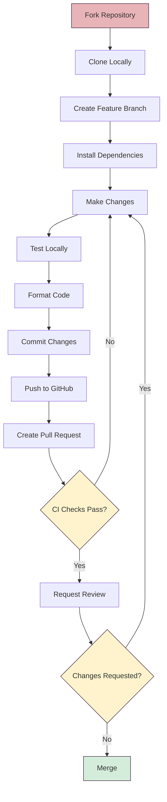

# Contributing to forschung.stadtgeschichtebasel.ch

Thank you for your interest in contributing to the Stadt.Geschichte.Basel research data platform!

We welcome contributions from the community to help improve our digital research platform. This project is built on [CollectionBuilder-CSV](https://collectionbuilder.github.io/) and extended with features specific to historical research and Basel's history.

## Project Resources

- **Website**: [forschung.stadtgeschichtebasel.ch](https://forschung.stadtgeschichtebasel.ch)
- **Main Project**: [Stadt.Geschichte.Basel](https://stadtgeschichtebasel.ch)
- **Documentation**: See the [README.md](README.md) and [docs/](docs/) folder
- **Issue Tracker**: [GitHub Issues](https://github.com/Stadt-Geschichte-Basel/forschung.stadtgeschichtebasel.ch/issues)
- **Discussions**: [GitHub Discussions](https://github.com/Stadt-Geschichte-Basel/forschung.stadtgeschichtebasel.ch/discussions)
- **CollectionBuilder Documentation**: [CB-Docs](https://collectionbuilder.github.io/cb-docs/)

## Getting Started

Before contributing, please:

1. Read through the [README.md](README.md) to understand the project structure
2. Check the [SETUP.md](SETUP.md) guide for detailed setup instructions
3. Review existing [issues](https://github.com/Stadt-Geschichte-Basel/forschung.stadtgeschichtebasel.ch/issues) and [pull requests](https://github.com/Stadt-Geschichte-Basel/forschung.stadtgeschichtebasel.ch/pulls)
4. Read our [Code of Conduct](CODE_OF_CONDUCT.md)

## How to Contribute

### Reporting Bugs

Found a bug? Please help us improve by reporting it!

1. **Search existing issues** first to avoid duplicates
2. **Use the bug report template** when creating a new issue
3. **Provide detailed information**:
   - Clear description of the bug
   - Steps to reproduce
   - Expected vs. actual behavior
   - Screenshots (if applicable)
   - Your environment (OS, browser, Ruby/Node.js versions)

### Suggesting Features

Have an idea for improvement?

1. **Check existing feature requests** to see if it's already proposed
2. **Use the feature request template** when creating a new issue
3. **Explain the use case** and how it would benefit the project
4. **Provide examples** or mockups if possible

### Asking Questions

For general questions about using the platform:

- Use [GitHub Discussions](https://github.com/Stadt-Geschichte-Basel/forschung.stadtgeschichtebasel.ch/discussions) for general questions
- Use [Issues](https://github.com/Stadt-Geschichte-Basel/forschung.stadtgeschichtebasel.ch/issues) only for bug reports and feature requests

### Documentation Improvements

Documentation improvements are always welcome!

1. Fix typos, clarify instructions, or add missing information
2. Add examples or screenshots where helpful
3. Update outdated information
4. Improve translations (German/Spanish/English)

## Submitting Pull Requests

We welcome [Pull Requests](https://help.github.com/en/articles/about-pull-requests)! Please follow these guidelines:

### Before You Start

1. **Fork the repository** and create a feature branch from `main`
2. **Set up your development environment** following [SETUP.md](SETUP.md)
3. **Check if an issue exists** for what you're working on (create one if not)
4. **Discuss major changes** in an issue before starting work

### Making Changes

1. **Follow coding conventions** (see below)
2. **Write clear commit messages** describing what and why
3. **Test your changes** locally before submitting
4. **Run formatters**: `npm run format` (Prettier)
5. **Update documentation** if you change functionality
6. **Keep changes focused**: one feature/fix per PR

### Submitting

1. **Fill out the PR template** completely
2. **Link related issues** using keywords (e.g., "Fixes #123")
3. **Provide context** about your changes and testing approach
4. **Be responsive** to feedback and questions
5. **Wait for CI checks** to pass before requesting review

## Development Workflow



**Command Reference**:

```bash
# 1. Fork and clone the repository
git clone https://github.com/YOUR-USERNAME/forschung.stadtgeschichtebasel.ch.git
cd forschung.stadtgeschichtebasel.ch

# 2. Create a feature branch
git checkout -b feature/your-feature-name

# 3. Install dependencies
npm run setup

# 4. Make your changes and test locally
npm run dev

# 5. Format your code
npm run format

# 6. Commit and push
git add .
git commit -m "Add: brief description of changes"
git push origin feature/your-feature-name

# 7. Create a Pull Request on GitHub
```

## Coding Conventions

This project follows these conventions to maintain code quality and readability:

### General

- **Comments**: Include clear inline comments, especially for complex logic
- **Code structure**: Keep it relatively simple and comprehensible
- **Educational outlook**: Write code that others can learn from

### Formatting

- **Use Prettier**: All code must be formatted with Prettier (`npm run format`)
- **Indentation**: Use 4 spaces for HTML, JS, CSS; 2 spaces for YAML
- **Liquid spacing**: `{{ site.example }}` ✓
- **Avoid excess whitespace**: Keep code clean and readable

### Metadata

- **Multi-valued fields**: Use `;` as separator (e.g., `subject1;subject2`)
- **Date formats**: Support EDTF (Extended Date/Time Format)
- **Language codes**: Use ISO 639-2 codes

### Features

- **Progressive enhancement**: Maintain backwards compatibility
- **Sane defaults**: Set default values in Liquid/JS when possible
- **Accessibility first**: Follow WCAG guidelines
- **Neurodiversity design**: Consider [Neurodiversity Design System](https://neurodiversity.design/) principles

### Branching

- **Main branch**: Production-ready code only
- **Feature branches**: Use descriptive names (e.g., `feature/add-timeline`)
- **Meaningful commits**: Use conventional commit messages when possible

## Areas Where You Can Help

### Priority Areas

- **Documentation**: Improve clarity, add examples, fix typos
- **Accessibility**: Test and improve WCAG compliance
- **Translations**: German, Spanish, English localization
- **Testing**: Manual testing of features across browsers
- **Data quality**: Metadata improvements and validation

### Technical Contributions

- **Bug fixes**: Address issues in the issue tracker
- **Feature enhancements**: Improve existing features
- **Performance**: Optimize load times and rendering
- **UI/UX**: Design improvements aligned with project goals

## Code Review Process

1. **Automated checks** run on all PRs (formatting, builds)
2. **Maintainer review** typically within 1 week
3. **Discussion and iteration** as needed
4. **Approval and merge** once all checks pass and review is complete

## Questions or Need Help?

- **General questions**: Use [GitHub Discussions](https://github.com/Stadt-Geschichte-Basel/forschung.stadtgeschichtebasel.ch/discussions)
- **Bug reports**: Open an [Issue](https://github.com/Stadt-Geschichte-Basel/forschung.stadtgeschichtebasel.ch/issues)
- **Contribution questions**: Comment on the relevant issue or PR

## License

By contributing, you agree that your contributions will be licensed under the [MIT License](LICENSE).
