# Setup Guide

This guide will help you set up the forschung.stadtgeschichtebasel.ch development environment on your local machine.

## Table of Contents

- [Prerequisites](#prerequisites)
- [Quick Start](#quick-start)
- [Detailed Setup](#detailed-setup)
- [Configuration](#configuration)
- [Verifying Your Setup](#verifying-your-setup)
- [Troubleshooting](#troubleshooting)
- [Next Steps](#next-steps)

## Prerequisites

Before you begin, ensure you have the following installed on your system:

### Required Software

1. **Git** (version 2.0 or higher)

   - [Download Git](https://git-scm.com/downloads)
   - Verify installation: `git --version`

2. **Node.js** (version 18.x or higher) and **npm**

   - [Download Node.js](https://nodejs.org/)
   - Verify installation: `node --version` and `npm --version`

3. **Ruby** (version 2.7.0 or higher) and **Bundler**

   - [Download Ruby](https://www.ruby-lang.org/en/downloads/)
   - Verify installation: `ruby --version`
   - Install Bundler: `gem install bundler`
   - Verify Bundler: `bundle --version`

4. **uv** (Python dependency manager)
   - Install: `pip install uv` or follow [uv installation guide](https://docs.astral.sh/uv/)
   - Verify installation: `uv --version`

### Optional but Recommended

- **Python** (version 3.9 or higher) - required for data processing
- **Text Editor**: [VS Code](https://code.visualstudio.com/), [Sublime Text](https://www.sublimetext.com/), or your preferred editor
- **Browser**: Chrome, Firefox, or Safari for testing

### System-Specific Notes

#### macOS

```bash
# Install Homebrew (if not already installed)
/bin/bash -c "$(curl -fsSL https://raw.githubusercontent.com/Homebrew/install/HEAD/install.sh)"

# Install dependencies
brew install git node ruby
gem install bundler
pip3 install uv
```

#### Linux (Ubuntu/Debian)

```bash
# Update package list
sudo apt update

# Install dependencies
sudo apt install git nodejs npm ruby-full build-essential
gem install bundler
pip3 install uv
```

#### Windows

We recommend using [WSL2 (Windows Subsystem for Linux)](https://docs.microsoft.com/en-us/windows/wsl/install) for the best development experience. Follow the Linux instructions above within your WSL2 environment.

Alternatively, use the Windows installers for each tool and run commands in PowerShell or Command Prompt.

## Quick Start

The fastest way to get started:

```mermaid
flowchart LR
    A[Clone Repository] --> B[Run npm run setup]
    B --> C[Start Dev Server]
    C --> D[Open Browser]
    D --> E[Site Running! 🎉]

    style A fill:#e8b4b8,stroke:#3a1e3e
    style E fill:#d4edda,stroke:#3a1e3e
```



**Commands**:

```bash
# 1. Clone the repository
git clone https://github.com/Stadt-Geschichte-Basel/forschung.stadtgeschichtebasel.ch.git
cd forschung.stadtgeschichtebasel.ch

# 2. Run the setup script (installs all dependencies)
npm run setup

# 3. Start the development server
npm run dev

# 4. Open your browser to http://127.0.0.1:4000
```

Your local development site should now be running! 🎉

## Detailed Setup

If you prefer to understand each step or need to troubleshoot:

### Step 1: Clone the Repository

```bash
# Clone via HTTPS
git clone https://github.com/Stadt-Geschichte-Basel/forschung.stadtgeschichtebasel.ch.git

# Or clone via SSH (if you have SSH keys set up)
git clone git@github.com:Stadt-Geschichte-Basel/forschung.stadtgeschichtebasel.ch.git

# Navigate to the project directory
cd forschung.stadtgeschichtebasel.ch
```

### Step 2: Install Node.js Dependencies

```bash
# Install npm packages (includes Prettier for code formatting)
npm install
```

This installs:

- `prettier` - Code formatter
- `@shopify/prettier-plugin-liquid` - Liquid template formatting support

### Step 3: Install Ruby Dependencies

```bash
# Configure bundler to install gems locally
bundle config set --local path 'vendor/bundle'

# Install Ruby gems
bundle install
```

This installs Jekyll and all required gems defined in `Gemfile`.

### Step 4: Install Python Dependencies

```bash
# Install Python packages with uv
uv sync
```

This sets up the Python environment needed for data processing scripts.

### Step 5: Verify Installation

```bash
# Check that Jekyll is installed
bundle exec jekyll --version

# Check that all npm scripts are available
npm run
```

## Configuration

### Environment Variables

For full functionality (especially data processing), create a `.env` file in the project root:

```bash
# Copy the example file
cp .env.example .env

# Then edit with your credentials
nano .env  # or use your preferred editor
```

The `.env` file should contain:

```env
# Omeka S API Configuration
OMEKA_API_URL=https://omeka.unibe.ch/api
KEY_IDENTITY=your_key_identity_here
KEY_CREDENTIAL=your_key_credential_here
ITEM_SET_ID=10780
```

> **Note**: To get API credentials:
>
> 1. Log in to the [Omeka S instance](https://omeka.unibe.ch)
> 2. Go to your user settings
> 3. Generate API keys under "API Keys"
> 4. Copy the Key Identity and Key Credential values

### Jekyll Configuration

The main configuration is in `_config.yml`. You generally don't need to modify this for local development, but you can customize:

- `title`: Site title
- `baseurl`: Base URL path (keep empty for local development)
- `url`: Production URL (change to `http://127.0.0.1:4000` for local testing)

## Verifying Your Setup

### 1. Start the Development Server

```bash
npm run dev
```

You should see output like:

```
Configuration file: /path/to/project/_config.yml
            Source: /path/to/project
       Destination: /path/to/project/_site
 Incremental build: enabled
      Generating...
                    done in X.XXX seconds.
 Auto-regeneration: enabled for '/path/to/project'
    Server address: http://127.0.0.1:4000
  Server running... press ctrl-c to stop.
```

### 2. Open the Site in Your Browser

Navigate to [http://127.0.0.1:4000](http://127.0.0.1:4000)

You should see the Stadt.Geschichte.Basel research data platform homepage.

### 3. Test Auto-Reload

1. Open any file in the project (e.g., `index.html`)
2. Make a small change and save
3. The site should automatically rebuild
4. Refresh your browser to see the changes

### 4. Check Code Formatting

```bash
# Check if code is properly formatted
npm run check

# Auto-format all code
npm run format
```

## Troubleshooting

### Common Issues

#### Issue: Ruby version mismatch

**Error**: `Your Ruby version is X.X.X, but your Gemfile specified Y.Y.Y`

**Solution**:

```bash
# Install the required Ruby version using rbenv or rvm
# For rbenv:
rbenv install 2.7.0
rbenv local 2.7.0

# For rvm:
rvm install 2.7.0
rvm use 2.7.0
```

#### Issue: Bundle install fails

**Error**: `An error occurred while installing [gem]`

**Solution**:

```bash
# On macOS/Linux, you may need to install build tools
# macOS:
xcode-select --install

# Ubuntu/Debian:
sudo apt-get install build-essential

# Then retry:
bundle install
```

#### Issue: Jekyll server won't start

**Error**: `Address already in use - bind(2)`

**Solution**:

```bash
# Port 4000 is already in use. Kill the process or use a different port:
bundle exec jekyll serve --port 4001
```

#### Issue: Missing Node modules

**Error**: `Cannot find module 'prettier'`

**Solution**:

```bash
# Clean and reinstall npm packages
rm -rf node_modules package-lock.json
npm install
```

#### Issue: Python/uv issues

**Error**: Problems with `uv` or Python packages

**Solution**:

```bash
# Reinstall uv
pip install --upgrade uv

# Reset Python environment
rm -rf .venv
uv sync
```

#### Issue: Data not loading

**Problem**: Objects or metadata not displaying

**Solution**:

```bash
# Process data from Omeka S (requires API credentials)
npm run populate

# Or use sample data if you don't have API access
# (Sample data setup instructions coming soon)
```

### Getting More Help

If you're still having issues:

1. Check the [TROUBLESHOOTING.md](TROUBLESHOOTING.md) guide
2. Search existing [GitHub Issues](https://github.com/Stadt-Geschichte-Basel/forschung.stadtgeschichtebasel.ch/issues)
3. Ask in [GitHub Discussions](https://github.com/Stadt-Geschichte-Basel/forschung.stadtgeschichtebasel.ch/discussions)
4. Open a new issue with:
   - Your operating system
   - Versions of Node.js, Ruby, Python
   - Full error messages
   - Steps to reproduce

## Next Steps

Now that your environment is set up:

1. **Read the Documentation**: Check out [README.md](README.md) for an overview
2. **Explore the Code**: Browse the project structure:
   - `_layouts/` - Page templates
   - `_includes/` - Reusable components
   - `pages/` - Site pages
   - `_data/` - Data files and configuration
   - `assets/` - CSS, JavaScript, images
3. **Learn About CollectionBuilder**: Read [CollectionBuilder Documentation](https://collectionbuilder.github.io/cb-docs/)
4. **Review Project Extensions**: See [README.md](README.md#project-specific-extensions-to-collectionbuilder) for Stadt.Geschichte.Basel-specific features
5. **Start Contributing**: Check [CONTRIBUTING.md](CONTRIBUTING.md) for guidelines
6. **Pick an Issue**: Browse [good first issues](https://github.com/Stadt-Geschichte-Basel/forschung.stadtgeschichtebasel.ch/issues?q=is%3Aissue+is%3Aopen+label%3A%22good+first+issue%22)

## Development Scripts Reference

| Command                    | Description                                     |
| -------------------------- | ----------------------------------------------- |
| `npm run setup`            | Complete setup: install all dependencies        |
| `npm run dev`              | Start development server with auto-reload       |
| `npm run serve`            | Alias for `dev`                                 |
| `npm run build`            | Build site for testing                          |
| `npm run build:production` | Build site with production optimizations        |
| `npm run populate`         | Fetch and process data from Omeka S             |
| `npm run clean`            | Remove generated files                          |
| `npm run format`           | Format code with Prettier                       |
| `npm run check`            | Check code formatting without making changes    |
| `npm run install:ruby`     | Install Ruby dependencies only                  |
| `npm run install:python`   | Install Python dependencies only                |
| `npm run install:all`      | Install Ruby and Python dependencies (not Node) |

Happy coding! 🚀
